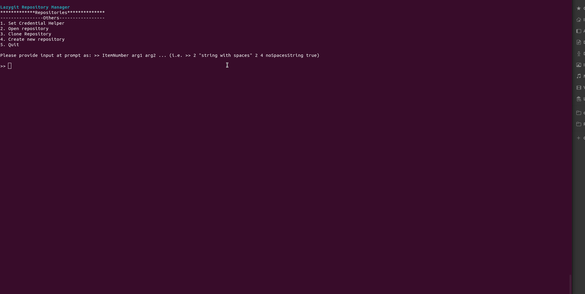

# lazygit-repository-manager

Lazygit repository manager, without need to open lazygit on folder

Its possible to:

- Access the repository with `lazygit`
- Open repository
- Clone repository
- Create repository
- Set/Unset `Git Credentials Helper` (To avoid insert username and password every time)

**Important:**

To use this script, you need to install `lazygit`. Click [here](https://github.com/jesseduffield/lazygit) to get more information.

During initialization, if global user information, like username and email, is not configured, it will ask for username and email.

## Demonstration

