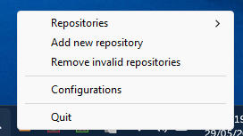
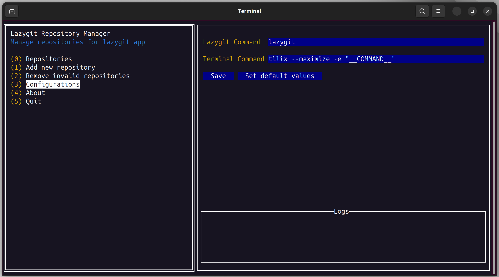

# lazygit-repository-manager

Lazygit repository manager, without need to open lazygit on folder

## Installation

#### Windows

You can download the latest version of application zip or run the following command:

1. Install Scoop. For more information visit: https://scoop.sh

`scoop install https://github.com/zecarneiro/lazygit-repository-manager/releases/download/v$APP_LATEST_VERSION/lazygit-repository-manager-win.json`

## Application images

**App will open in system tray**

**App Configuration**

