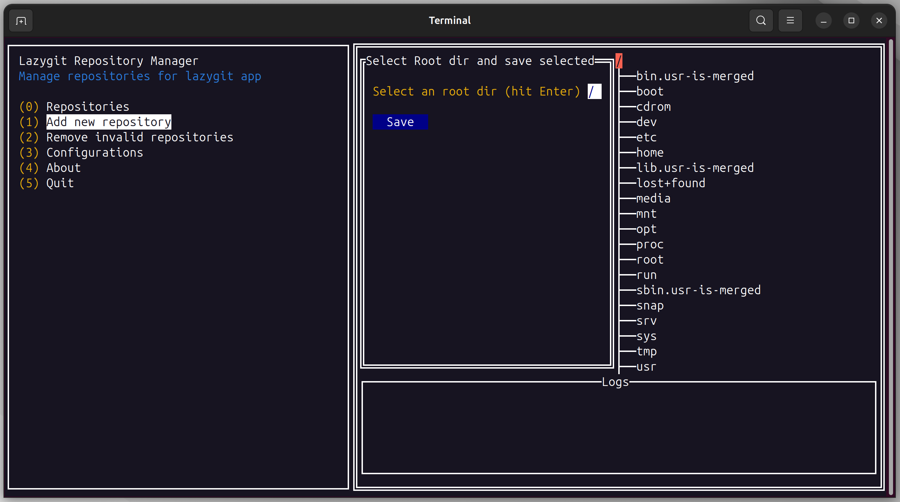

# lazygit-repository-manager

Lazygit repository manager, without need to open lazygit on folder

## Installation

#### Windows

You can download the latest version of application zip or run the following command:

1. Install Scoop. For more information visit: https://scoop.sh

2. Run:

```
scoop install https://github.com/zecarneiro/lazygit-repository-manager/releases/download/v$APP_LATEST_VERSION/lazygit-repository-manager.json
```

#### Linux

NOTE: Only tested on Ubuntu

You can download the latest version of application zip or run the following command:

1. Install `wget` and `unzip` first
2. Run:

```
bash -c "$(wget -qO - 'https://github.com/zecarneiro/lazygit-repository-manager/releases/download/v$APP_LATEST_VERSION/lazygit-repository-manager.sh')"
```

## Application images


**App Configuration**


**Select Repos**


